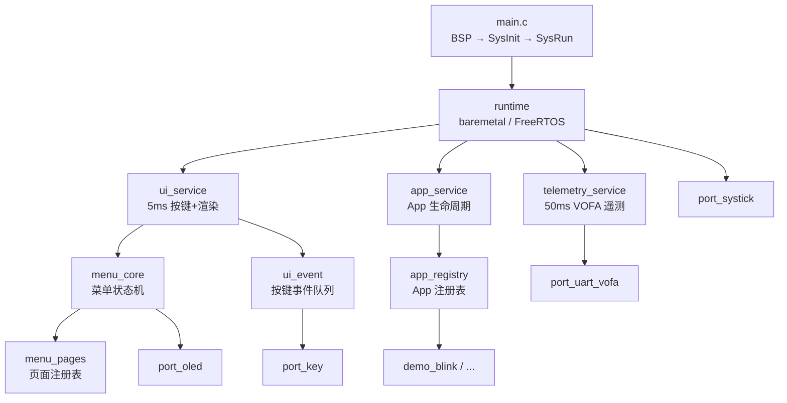

# HC_EMBED_RULES

> **架构基线声明：HC_EMBED_RULES 是本仓库唯一目标架构。**
>
> `port/` 的硬件抽象层已迁移至 `hc_hal/` + `hc_driver/`，旧 port 文件仅保留兼容转发。`runtime/` `service/` `app/` `ui/` `system/` `scheduler/` 仍为 HC_Sys_Menu v1.0 遗留实现，处于待迁移状态。**禁止**在上述旧目录及分层中增加新耦合、新模块或新依赖关系。所有新增代码必须遵守 HC_EMBED_RULES 分层。

---

## 1. 目标架构：HC_EMBED_RULES

### 1.1 目标目录结构

```text
framework/
├── hc_common/               # 平台公共类型、错误码、基础宏
│   ├── hc_err.h             #   统一错误码枚举
│   ├── hc_types.h           #   平台基础类型定义
│   └── hc_def.h             #   平台基础宏与常量
│
├── hc_cfg/                  # 编译期配置（开关、引脚、功能裁剪）
│   ├── hc_target_cfg.h      #   目标芯片 / 编译器配置
│   ├── hc_board_cfg.h       #   板级引脚与资源映射
│   ├── hc_feature_cfg.h     #   功能模块开关裁剪
│   └── hc_module_cfg.h      #   模块依赖校验与拓扑约束
│
├── hc_hal/                  # 硬件抽象层（GPIO/UART/I2C/PWM/DMA/SysTick/Delay/WDG）
│   ├── hc_hal_gpio.h        #   GPIO 通用输入/输出/中断分发（不含编码器业务语义）
│   ├── hc_hal_uart.h        #   UART 通用收发
│   ├── hc_hal_i2c.h         #   I2C 通用读写
│   ├── hc_hal_pwm.h         #   PWM 通用输出
│   ├── hc_hal_dma.h         #   DMA 通用传输
│   ├── hc_hal_systick.h     #   1ms 时基
│   ├── hc_hal_delay.h       #   微秒/毫秒延时
│   ├── hc_hal_dwt.h         #   DWT 周期计数器
│   ├── hc_hal_timer.h       #   通用定时器
│   ├── hc_hal_wdg.h         #   独立看门狗
│   └── platform/{stm32,mspm0}/  #   平台 .c 实现与 cfg
│
├── hc_driver/               # 设备驱动层（外设芯片驱动，禁止反向依赖上层）
│   └── hc_driver_encoder.h/.c  #   编码器累计计数与四倍频解码
│
├── hc_middleware/            # 通用中间件（协议栈、算法库、文件系统适配）
│   └── ...
│
├── hc_service/               # 业务服务层（领域服务，可互相调用但须声明依赖）
│   └── ...
│
├── hc_task/                  # 任务调度层（FreeRTOS / 裸机时间片）
│   └── ...
│
├── hc_app/                   # 应用入口与场景逻辑
│   └── ...
│
├── port/                    # [旧→兼容] 原 HC_Sys_Menu 硬件适配层，现已转发至 hc_hal
├── runtime/                 # [旧] HC_Sys_Menu 双后端运行时 —— 待迁移
├── service/                 # [旧] HC_Sys_Menu 常驻服务层 —— 待迁移
├── scheduler/               # [旧] HC_Sys_Menu 调度层 —— 待迁移
├── app/                     # [旧] HC_Sys_Menu App 层 —— 待迁移
├── ui/                      # [旧] HC_Sys_Menu UI 层 —— 待迁移
├── system/                  # [旧] HC_Sys_Menu 系统配置 —— 待迁移
├── examples/                # 示例代码
└── Ai_tools/                # AI 辅助开发工具
```

### 1.2 依赖方向

```text
hc_app          ──→  hc_service  ──→  hc_middleware  ──→  hc_driver  ──→  hc_hal
                      │                    │
                      └──→  hc_task  ─────┘

hc_cfg           ←──  所有层均可引用（编译期配置，只读）

hc_common        ←──  所有层均可引用（类型与错误码，无反向依赖）
```

依赖规则：

```text
hc_app          可以依赖 hc_service / hc_task / hc_middleware / hc_cfg / hc_common
hc_service      可以依赖 hc_middleware / hc_driver / hc_cfg / hc_common
hc_middleware    可以依赖 hc_driver / hc_cfg / hc_common
hc_driver        可以依赖 hc_hal / hc_cfg / hc_common
hc_hal           可以依赖 hc_cfg / hc_common
hc_task          可以依赖 hc_service / hc_middleware / hc_cfg / hc_common
```

### 1.3 禁止的依赖（编码红线）

```text
1. hc_app 禁止直接依赖 hc_hal / hc_driver（必须通过 hc_service 或 hc_middleware）
2. hc_service 之间禁止互相依赖（各自独立）
3. hc_middleware 禁止直接依赖厂商 SDK / BSP
4. hc_driver 禁止反向依赖 hc_service / hc_app
5. hc_hal 禁止依赖除 hc_common / hc_cfg 之外的任何层
6. 所有层禁止跨层直接访问全局变量（必须通过接口函数）
7. 所有数据结构编译期静态分配，禁止 malloc
8. 禁止在 ISR 中做任何业务处理（仅标记/缓冲）
9. 禁止向旧的 port/runtime/service/app/ui/scheduler/system 目录增加新模块或新耦合
```

### 1.4 迁移状态

| 旧目录 | 目标目录 | 状态 |
|--------|---------|------|
| `port/` | `hc_hal/` + `hc_driver/` | **已迁移**（公共头 + 平台实现 + encoder 已移至 canonical 目录，旧 port 仅保留兼容转发） |
| `runtime/` | `hc_task/` | 待迁移 |
| `service/` | `hc_service/` | 待迁移 |
| `app/` | `hc_app/` | 待迁移 |
| `ui/` | `hc_app/` + `hc_middleware/` | 待迁移 |
| `scheduler/` | `hc_task/` | 待迁移 |
| `system/` | `hc_cfg/` | 待迁移 |
| `hc_common/` | — | **已建立** |
| `hc_cfg/` | — | **已建立**（含 target/board/module 三级配置） |
| `hc_hal/` | — | **已建立**（14 个公共头 + stm32/mspm0 双平台实现） |
| `hc_driver/` | — | **已建立**（encoder 编码器驱动） |

### 1.5 目标平台覆盖

| 平台 | 系列 | 内核 | 典型场景 |
|------|------|------|---------|
| **MSPM0** | MSPM0G/C/L | Cortex-M0+ | 超低功耗传感节点 |
| **STM32 F1** | STM32F103 | Cortex-M3 | 通用控制、菜单交互 |
| **STM32 F4** | STM32F407/429 | Cortex-M4 | 高性能 DSP / 浮点运算 |
| **STM32 H7** | STM32H723/743 | Cortex-M7 | 复杂协议栈、高速通信 |
| **ESP32** | ESP32-S3/C3/C6 | Xtensa / RISC-V | 无线连接、WiFi / BLE 应用 |

跨平台策略：

```text
1. hc_hal 封装所有 MCU 差异（GPIO/UART/I2C/SPI/SysTick），上层零感知
2. hc_cfg 通过 hc_target_cfg.h 选择目标芯片，编译期裁剪
3. 厂商 SDK / BSP 仅允许在 hc_hal 和 hc_driver 内部引用
4. 业务层禁止出现任何芯片型号宏、寄存器地址、引脚号
```

### 1.6 层的宏与注入权限

| 层 | 编译期宏 | 静态函数表 | 句柄注入 | 禁止 |
|----|---------|-----------|---------|------|
| **hc_common** | 平台基础宏 | — | — | 类型定义不得包含平台相关宏 |
| **hc_cfg** | 全部宏（芯片选择、板级映射、功能开关、模块依赖校验） | — | — | 不得生成运行时代码 |
| **hc_hal** | 通过 hc_cfg 引用目标芯片宏 | 允许 HAL 操作函数表 | — | 禁止暴露芯片寄存器地址到上层 |
| **hc_driver** | 通过 hc_cfg 引用外设使能宏 | 允许驱动操作函数表 | 允许初始化时注入 HAL 操作句柄 | 禁止反向依赖 hc_service / hc_app |
| **hc_middleware** | 通过 hc_cfg 引用功能开关宏 | **允许**（可替换后端：通信协议栈、存储后端、算法实现） | **允许**注入可替换后端句柄 | 禁止直接依赖厂商 SDK / BSP |
| **hc_service** | 通过 hc_cfg 引用功能开关宏 | **允许**（可替换执行器：传感器采集、执行器控制、mock 实现） | **允许**注入可替换实现句柄 | **禁止**运行时容器式 DI、动态注册 |
| **hc_task** | 通过 hc_cfg 引用调度策略宏 | — | — | 禁止自行创建任务 |
| **hc_app** | 通过 hc_cfg 引用功能开关宏 | — | — | **禁止**任何注入机制、禁止直接引用 hc_hal/hc_driver |

注入原则：

```text
1. 只有「可替换后端」才允许静态函数表或句柄注入：
   - 通信后端（UART / SPI / I2C 的不同实例）
   - 存储后端（Flash / EEPROM / SD 的不同实现）
   - 执行器 / 传感器（不同型号的驱动替换）
   - 需要 mock 的模块（单元测试场景）

2. 注入方式限定：
   - 编译期：通过 hc_cfg 宏选择具体实现文件
   - 链接期：通过 Makefile/CMake 选择编译单元，同名函数不同实现
   - 初始化期：通过静态函数表指针或句柄在 init() 中一次性注入
   - 禁止：运行时 setter 注入、动态注册表、全局服务容器

3. 禁止注入的场景：
   - 业务逻辑层的领域服务（hc_service 之间独立，不互相注入）
   - 应用入口层（hc_app 直接组装依赖，不通过容器解析）
   - 单例硬件资源（SysTick、唯一 UART 调试口）
```

### 1.7 RAM 优先裁剪原则

```text
优先级（从高到低）：

1. 编译期静态分配 —— 所有数据结构编译期确定大小，禁止 malloc / calloc / realloc
2. 功能开关裁剪 —— 通过 hc_feature_cfg.h 关闭不需要的模块，对应代码和数据完全不链接
3. 零拷贝传递 —— 模块间传递指针而非复制数据，缓冲区所有权在 init 时一次性分配
4. 池化复用 —— 同类型小对象使用静态对象池，编译期配置池大小
5. 惰性初始化 —— 非启动关键模块在使用时才初始化，避免启动时全部展开

禁止项：
- 运行时容器式 DI（依赖注入容器、服务定位器、IOC 容器）
- 动态注册式对象图（运行时 register/unregister 机制）
- 反射 / 序列化 / 动态类型识别
- 除 hc_cfg 之外的运行时配置解析（JSON / TOML / XML 解析器）
- 超过 1KB 的栈帧（大缓冲区必须静态分配或通过 hc_cfg 配置）
```

### 1.8 当前版本

```text
Project:  HC_EMBED_RULES
Version:  v0.2.0-beta
Status:   hc_hal + hc_driver 已迁移，剩余旧目录待迁移
Targets:  MSPM0 / STM32 F1 / STM32 F4 / STM32 H7 / ESP32
Compiler: C99 / C11, ARM GCC / Xtensa GCC / RISC-V GCC
```

---

## 2. 遗留实现：HC_Sys_Menu v1.0（待迁移）

> 以下为 HC_Sys_Menu v1.0 的架构设计说明。该部分描述了当前 `port/` `runtime/` `service/` `app/` `ui/` `system/` `scheduler/` 目录的实现，将按 1.4 节迁移表逐步迁移至 HC_EMBED_RULES 分层。**在新代码中不得以此作为架构参考。**

### 2.1 框架定位

HC_Sys_Menu 解决以下问题：

```text
1. OLED 多级菜单 —— 页面静态注册 + 按键导航，无需动态内存
2. App 生命周期管理 —— 统一 init/enter/exit/tick/render 钩子
3. 双后端调度 —— 裸机时间片与 FreeRTOS 任务，编译期切换
4. 按键事件驱动 —— 环形缓冲队列 + 扫描-消费模型
5. VOFA 遥测对接 —— 运行时变量实时上传上位机
6. 硬件适配抽象 —— port/ 层隔离 MCU 差异，移植只改 port/
```

不做的事情：

```text
1. 不做图形 UI 库
2. 不做文件系统 / 网络 / BLE / OTA
3. 不做外设驱动（GPIO/PWM/I2C 属于 BSP，不在框架内）
4. 不绑定特定 MCU 或 RTOS
5. 不用动态内存分配
```

### 2.2 目录结构

```text
framework/
├── port/                   # 硬件适配层 —— 按键/OLED/UART/SysTick 抽象接口
│   ├── hc_common.h         #   框架最小公共类型 (HC_Bool_e / HC_UNUSED)
│   ├── port_key.h          #   4 键逻辑抽象 (K1~K4: 上/下/确认/返回)
│   ├── port_oled.h         #   OLED 显示抽象 (页寻址, 8x16 字模)
│   ├── port_uart_vofa.h    #   VOFA 串口字节流出口
│   └── port_systick.h      #   1ms 时基统一入口
│
├── system/                 # 系统配置
│   ├── hc_runtime_cfg.h    #   编译期选择裸机 / FreeRTOS
│   ├── main.c              #   应用主入口 (BSP -> SysInit -> SysRun)
│   └── sys_init.c          #   系统初始化骨架
│
├── runtime/                # 双后端运行时
│   ├── runtime.h           #   统一接口 (Init / Start / EnterApp / LeaveApp)
│   ├── runtime_baremetal.c #   裸机时间片后端 (5ms/50ms/500ms 软分频)
│   └── runtime_freertos.c  #   FreeRTOS 后端 (ui_task / app_task / telemetry_task)
│
├── scheduler/              # 调度层 (部分兼容重定向)
│   ├── task_scheduler.h    #   系统状态枚举 + SysInit/SysRun 声明
│   ├── run_runtime.h       #   -> runtime/runtime.h
│   ├── run_registry.h      #   -> app/app_registry.h
│   └── vofa_register.h     #   -> service/telemetry_service.h
│
├── service/                # 常驻服务层
│   ├── ui_service          #   5ms 周期: 按键扫描 -> 菜单处理 -> OLED 渲染
│   ├── app_service         #   App 生命周期管理 (enter/exit/tick 分发)
│   └── telemetry_service   #   50ms 周期: VOFA Profile 数据采集与发送
│
├── app/                    # App 层
│   ├── app_registry        #   App 注册表 (静态数组, 自动生成菜单项)
│   └── demo_blink/         #   示例 App: 500ms 闪烁 + VOFA 遥测
│
├── ui/                     # UI 层
│   ├── menu_core           #   菜单核心: 状态机/按键映射/脏标志渲染
│   ├── menu_pages          #   页面静态注册表 (HOME / DEBUG / RUNNING)
│   └── ui_event            #   按键事件缓冲队列 (环形缓冲, ISR 安全)
│
├── Ai_tools/               # AI 辅助开发工作流
│   ├── agent/              #   Codex 任务单 schema
│   ├── prompts/            #   Claude + Codex 协作 prompt 模板
│   └── tools/              #   校验脚本
│
└── examples/               # 示例代码副本
    └── demo_blink/
```

### 2.3 分层架构



### 2.4 依赖规则（旧结构，仅适用于遗留代码）

```text
main.c               可以调用 BSP / SysInit / SysRun
runtime              可以调用 service 层全部模块
service              可以调用 app / ui / port 层
app                  可以调用 ui / port / telemetry_service
ui                   可以调用 port_oled / port_key / app_registry
port                 不依赖框架内任何模块 (仅依赖 hc_common.h)
```

禁止：

```text
app 直接调用 BSP / HAL
ui 直接操作 MCU 寄存器
service 之间互相依赖 (各自独立)
runtime 直接操作 OLED / 按键硬件
port 反向依赖 service / app / ui
```

### 2.5 各模块行为定义

| 模块 | 职责 | 可以做 | 不可以做 |
|---|---|---|---|
| `port/` | 硬件适配抽象 | 定义按键/OLED/UART/SysTick 接口 | 写菜单逻辑 / App 业务 |
| `system/` | 启动配置 | 编译期开关、初始化链路 | 写周期任务 / UI 逻辑 |
| `runtime/` | 执行后端 | 裸机时间片分频 / FreeRTOS 任务创建 | 直接操作 OLED / 按键 |
| `service/ui_service` | UI 常驻服务 | 5ms 周期按键扫描+菜单处理+渲染 | 操作 App 业务数据 |
| `service/app_service` | App 生命周期 | enter/exit/tick 分发 | 直接渲染 OLED |
| `service/telemetry_service` | 遥测服务 | 50ms VOFA Profile 数据采集 | 修改 App 状态 |
| `app/` | 业务 App | 实现 init/enter/exit/tick/render 钩子 | 直接读按键 / 直接操作 OLED |
| `ui/menu_core` | 菜单核心 | 页面导航/光标/可视窗口/脏标志 | 知道 App 业务语义 |
| `ui/menu_pages` | 页面注册表 | 静态定义页面结构 + App 菜单项自动构建 | 处理按键事件 |
| `ui/ui_event` | 事件队列 | 环形缓冲 push/pop (ISR 安全) | 处理菜单逻辑 |

### 2.6 核心设计模式

#### 双后端运行时

编译期通过 `HC_RUNTIME_MODE` 选择执行后端，上层 service 代码完全不变：

```c
// system/hc_runtime_cfg.h
#define HC_RUNTIME_BAREMETAL 0
#define HC_RUNTIME_FREERTOS  1
#define HC_RUNTIME_MODE      HC_RUNTIME_BAREMETAL  // 改这里切换
```

**裸机后端** — 主循环内软分频：

```text
SysTick 1ms ISR
  └─ HcRuntime_Tick1ms()
       ├─ 5ms 分频  → s_ui_5ms_ready++
       ├─ 50ms 分频 → s_telemetry_50ms_ready++
       └─ 500ms 分频 → s_app_500ms_ready++

main loop (HcRuntime_Start)
  ├─ if 5ms_ready   → UiService_Run5ms() + AppService_RunActive5ms()
  ├─ if 50ms_ready  → TelemetryService_Run50ms()
  └─ if 500ms_ready → AppService_RunActive500ms()
```

**FreeRTOS 后端** — 三个独立任务：

| 任务 | 周期 | 优先级 |
|---|---|---|
| ui_task | 5ms | idle+3 |
| app_task | 5ms (500ms 内部分频) | idle+2 |
| telemetry_task | 50ms | idle+1 |

#### App 注册表模式

每个 App 只填写一个静态结构体，菜单自动生成：

```c
// app/app_registry.h
typedef struct {
    HcAppId_e      id;
    const char*    name;          // 菜单显示名
    MenuPageId_e   target_page;   // 进入后跳转到 PAGE_RUNNING
    HC_Bool_e      show_in_home;  // 是否出现在主菜单
    HC_Bool_e      show_in_debug; // 是否出现在 DEBUG 菜单
    HcAppHookFn    init;          // 上电初始化 (只跑一次)
    HcAppHookFn    enter;         // 进入 App
    HcAppHookFn    exit;          // 退出 App
    HcAppTickFn    tick_5ms;      // 5ms 周期回调
    HcAppTickFn    tick_500ms;    // 500ms 周期回调
    HcAppRenderFn  render;        // 自定义渲染 (可为 NULL 用默认)
} HcAppReg_t;
```

注册一个新 App 只需在 `app_registry.c` 数组中加一行：

```c
const HcAppReg_t g_hc_apps[] = {
    { HC_APP_DEMO_BLINK, "BLINK", PAGE_RUNNING,
      HC_TRUE, HC_FALSE,
      DemoBlink_Init, DemoBlink_Enter, DemoBlink_Exit,
      (HcAppTickFn)0, DemoBlink_Task500ms,
      DemoBlink_Render }
};
```

#### 菜单脏标志渲染

OLED 渲染只在内容变化时触发，避免无谓的 I2C 刷新：

```c
// 当状态变化时
Menu_RequestRedraw();   // 置 s_tMenuState.dirty = HC_TRUE

// 5ms 周期检查
void Menu_RenderIfDirty(void) {
    if (dirty == HC_FALSE) return;
    OLED_Clear();
    page->custom_render(...);   // 策略模式：每页可自定义渲染函数
    dirty = HC_FALSE;
}
```

#### 按键事件模型

```
物理按键 (GPIO)          逻辑按键               菜单动作
─────────────────       ─────────              ────────
K1 (上)           →     KEY_ID_K1       →      MENU_KEY_UP
K2 (下)           →     KEY_ID_K2       →      MENU_KEY_DOWN
K3 (确认)         →     KEY_ID_K3       →      MENU_KEY_ENTER
K4 (返回)         →     KEY_ID_K4       →      MENU_KEY_BACK
```

- `Key_Scan()` 在 UiService 5ms 周期中自动调用
- `Key_PollPressEvent()` 消费单次按下事件（按 K1→K4 优先级）
- 框架不区分长按/连发，由上层自行扩展

#### 系统状态机

```
SYS_STA_INIT  ──→  SYS_STA_IDLE_PAGE  ──→  SYS_STA_RUNNING
(一次性初始化)      (菜单浏览态)            (App 运行态)
                      ↑                        │
                      └──────── 退出 App ───────┘
```

- `SYS_STA_INIT`: 上电时执行 `SysInit()`，完成后转入 IDLE
- `SYS_STA_IDLE_PAGE`: 仅运行 UI 任务，用户在菜单中浏览
- `SYS_STA_RUNNING`: 有激活的 App，运行其 tick/render 回调

### 2.7 时间预算

| 频率 | 消费者 | 做什么 |
|---|---|---|
| 1ms (ISR) | `HcRuntime_Tick1ms` | 软分频计数器推进（仅裸机） |
| 5ms | `UiService_Run5ms` | Key_Scan → Menu_HandleKey → Menu_RenderIfDirty |
| 5ms | `AppService_RunActive5ms` | 当前 App 的 tick_5ms |
| 50ms | `TelemetryService_Run50ms` | VOFA 遥测数据打包发送 |
| 500ms | `AppService_RunActive500ms` | 当前 App 的 tick_500ms |

### 2.8 系统启动链路

```
main()
  ├─ BSP_LowLevelInit()        ← 用户实现：HAL_Init + 时钟 + 外设 MX_Init
  ├─ SysInit()
  │    ├─ g_eSysFlagManage = SYS_STA_INIT
  │    ├─ OLED_Init()          ← port 层
  │    ├─ Key_Init()           ← port 层
  │    └─ Menu_Init()          ← 注册页面 + 初始化 App 注册表
  └─ SysRun()
       ├─ HcRuntime_Init()     ← 初始化 Telemetry/Ui/App 服务
       │    └─ g_eSysFlagManage = SYS_STA_IDLE_PAGE
       └─ HcRuntime_Start()    ← 进入主循环 / 启动 FreeRTOS 调度器
            └─ 永不返回
```

### 2.9 编码红线（旧结构，仅适用于遗留代码）

```text
1.  App 不允许直接调用 port_key / port_oled，必须通过 ui/menu 或 service 接口
2.  port/ 层不允许 include 框架内除 hc_common.h 外的任何头文件
3.  service 之间不允许互相依赖
4.  menu_core 不允许知道 App 具体业务语义
5.  所有数据结构编译期静态分配，不允许 malloc
6.  新增 App 只应在 app_registry.c 中加一行，不应修改 menu/ 或 service/ 代码
7.  裸机后端 ISR 只推进计数器，不允许在 ISR 中做任何业务处理
```

### 2.10 移植指南

移植到新 MCU 只需实现以下 4 个文件：

| 文件 | 需要实现的函数 |
|---|---|
| `port_key.c` | `Key_Init()` `Key_Scan()` `Key_PollPressEvent()` |
| `port_oled.c` | `OLED_Init()` `OLED_Clear()` `OLED_ShowString()` `OLED_ShowChar()` |
| `port_uart_vofa.c` | `Vofa_SendBytes()` |
| `port_systick.c` | 在 1ms SysTick ISR 中调用 `TaskTimeSliceManage()` (裸机) 或空实现 (FreeRTOS) |

其余框架代码零修改。

### 2.11 快速判断口诀

```text
碰硬件 GPIO   → port/  (用户实现)
显示字符      → port_oled
读按键        → port_key
发 VOFA 数据  → port_uart_vofa
1ms 时基      → port_systick
菜单导航      → ui/menu_core
页面定义      → ui/menu_pages
按键缓冲      → ui/ui_event
App 生命周期  → service/app_service
UI 扫描渲染   → service/ui_service
遥测采集      → service/telemetry_service
新增业务 App  → app/ + 在 app_registry.c 中注册一行
选裸机/RTOS   → system/hc_runtime_cfg.h
后端执行      → runtime/
```

### 2.12 当前版本

```text
Project:  HC_Sys_Menu (待迁移至 HC_EMBED_RULES)
Version:  v1.0
Target:   STM32F103C8T6 (可移植)
RTOS:     Baremetal / FreeRTOS 双后端
Display:  OLED 128x64 (SSD1306 / SH1106, I2C / SPI)
Periph:   4-Keys + OLED + UART(VOFA)
Compiler: C99 / ARM GCC
```
